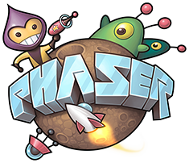

# 介绍

Phaser是一个专注于桌面和移动端的HTML5游戏引擎，是国外最火的一个HTML5游戏引擎。如果你是一个刚刚踏入游戏行业的新手，那么用Phaser入门是再合适不过了。

笔者曾经也使用过cocos2d，unity3d，egret等等游戏引擎，最终还是选用了Phaser，因为它平易近人，踏实沉稳，让人很舒服。

笔者一次偶然的机会发现了Phaser这个游戏引擎，一下子爱上了它，相见恨晚。但是中国Phaser的资料和书籍还非常少，实在可惜，故笔者不遗余力地为Phaser提供中文学习资料，录制教学视频，收集优秀案例，组织QQ讨论群，希望能够将Phaser这款优秀的HTML5游戏引擎介绍给大家。

## Phaser的优势

*   十分简易的环境搭建

不知道大家有没有用过unity3d或者cocos2d或者egret这类游戏引擎，它们的特点是有丰富的IDE，工具链，缺点是不易上手，初学者配置一个开发环境就要半天。

而Phaser的开发环境配置起来特别简单，只需要引入一个js文件即可。你可以用任何编写js的IDE来写Phaser，比如Sublime、WebStorm或者nodepad++。然后把项目放到服务器环境即可跑起来。具体请看[环境搭建](ENVIRONMENT.md)小节。

同时，Phaser不像egret那样必须用TypeScript来开发。Phaser非常灵活，你可以用es5来开发它，也可以用es6，也可以用TypeScript，哪个用着顺手就用哪个。

*   丰富的功能

市面上的H5引擎并不少，但是Phaser可以说是2D中最出色的一个。Phaser提供的功能非常全面，比如物理引擎，Phaser默认内置3种物理引擎，ARCADE，P2，Ninja，各自有各自的适用场景，使用起来也非常方便。

同时，Phaser还支持瓦片地图、定时器、渐变动画、帧动画、滚动背景、对象池、照相机、粒子系统、图形绘制、位图、像素图、图集、加载管理、多点触摸、音视频等等几乎你能够想到的所有做游戏需要的基础功能，是目前市面上2D的H5引擎中功能最丰富的一个。

*   超强定制能力

Phaser的定制能力到底有多强，可以从两方面来讲。

第一，Phaser的插件机制。Phaser可以允许开发者通过插件来引入其他强大的能力，比如通过插件你可以引入box2d物理引擎，引入spine骨骼动画，引入列表控件等等。Phaser的插件机制为Phaser提供了无限可能性，强大的插件功能使得Phaser几乎无所不能。

第二，Phaser的模块化编译。由于Phaser是源码开放的，我们可以从官方github上获取其源码进行编译，从而编译出我们自己的Phaser。同时，官方的源码写得非常漂亮，在设计之初就考虑到了模块化编译，比如你不需要p2引擎，那么你就可以编译一个phaser-arcade-physics版本，甚至你不需要物理引擎，那么你可以编译一个minimum版本。只需要在编译的时候添加一个参数就好，十分方便，具体请看[编译自己的Phaser](COMPILE.md)小节

*   Phaser小站

Phaser的文档其实是非常健全的，它其实就是从源码的注释中生成的，唯一的缺点就是是英文的，这也没办法，毕竟Phaser是国外的游戏引擎。同时，Phaser的中文资料也非常少。

但是，Phaser小站的诞生打破了这一局面，[Phaser小站](https://www.phaser-china.com)进行了文档翻译，教程编写，示例注释，完整游戏案例源码提供，同时还提供免费的视频教程和直播教程，是你学习Phaser找资料的不二之选。

因为有了Phaser小站，Phaser将会与众不同。

***

如果你也和我一样，是一个极简主义者，那么Phaser将会是你得心应手的一件利器。

