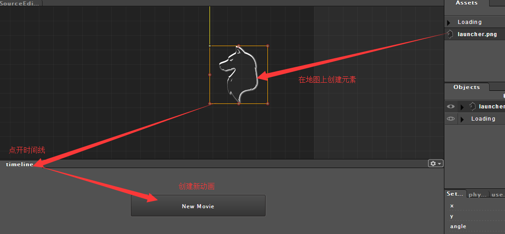
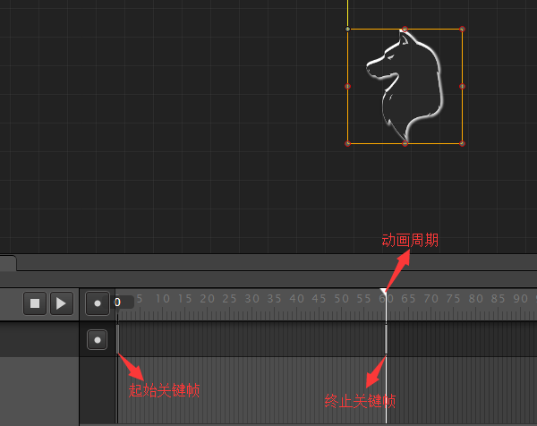
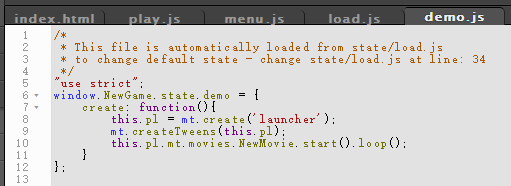
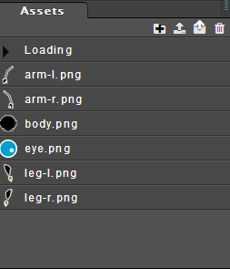
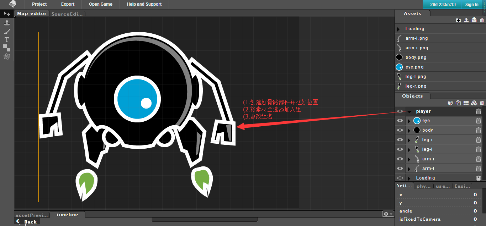
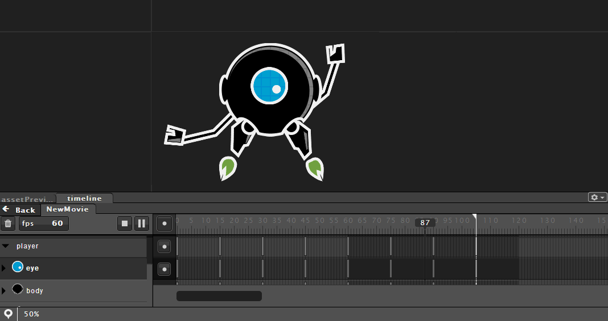

# Phaser MightyEditor Tutorials

## 基础动画

首先就地取材将游戏元素拖到地图编辑器上后创建新动画

在动画编辑器中编辑好动画之后写上如下代码

## 骨骼动画

首先将骨骼素材上传到编辑器中

然后把骨骼部件全部在地图编辑器上创建出来并摆放好位置

在对象管理器中选中目标组并创建新动画

###### 注意

1. 由动画编辑器创建的动画，其代码一致；要注意的就是动画的名称
2. 可以先创建动画然后由逻辑控制动画的播放
