# Phaser MightyEditor Tutorials
## 基础知识

 

Click The Image To Start Your Game Delevelop

## 资源加载

###### 如何将资源上传到游戏工程

首先打开本地服务

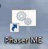

然后在浏览器地址栏输入localhost:8080
创建好新项目后直接从本地桌面将素材资源拖拽到编辑器中

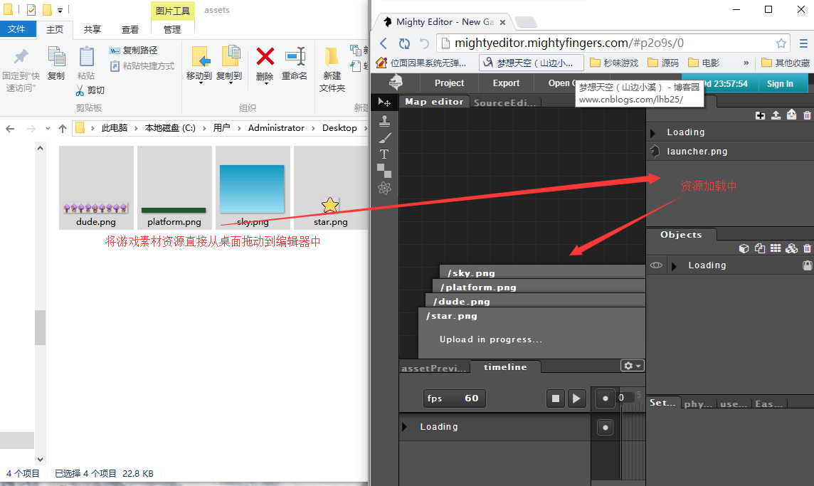

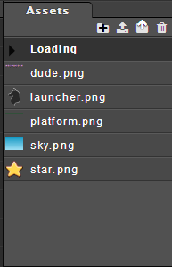

没错！资源加载就是这么简单！！！
这里要说下，音频视频的加载支持不太友好可能拖拽一百次也加载不了，也许你一次就加载成功不过工具是死的，人是活的嘛！我们打开游戏项目的目录

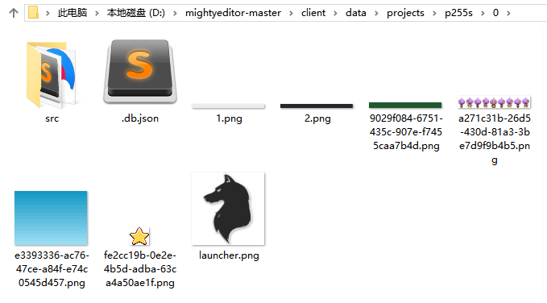

将音视频资源直接放进工程目录即可
资源加载完毕了，我们还需要知道要怎么使用
首先将要使用的资源从资源管理器中拖拽到地图编辑器上

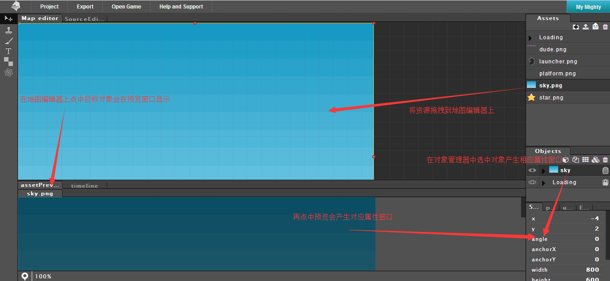

我们可以在对象管理器中修改对象名称(代码创建时的键值名)

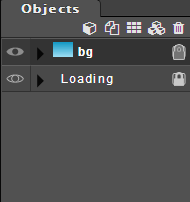

代码创建游戏对象用mt.create()

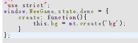

看下执行效果

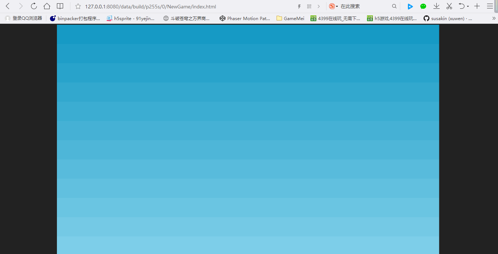

## 认识代码编辑器

首先我们来看一下MightyEditor中的代码文件

###### manifest.json

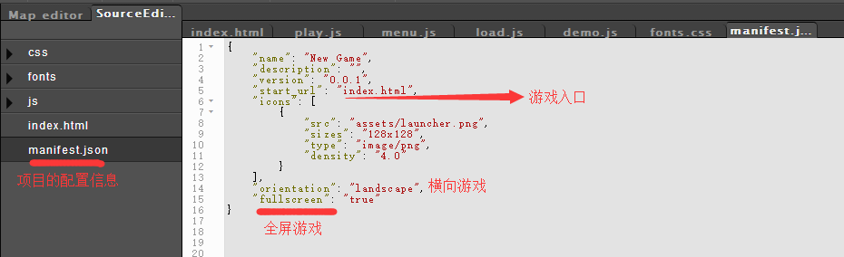

css/fonts对于直接游戏开发无太大关系可删除,如果是制作课件或许需要，视情况而定。
main.js为游戏主体(承上启下)

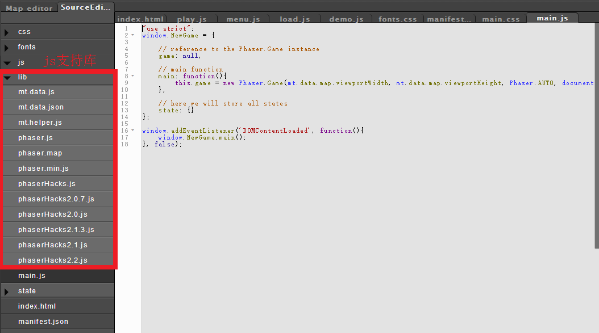

其中mt.data.js/json文件即为地图编辑器上的数据支持，其他没啥说的，这里就不再赘述了
我们最后来看下场景文件

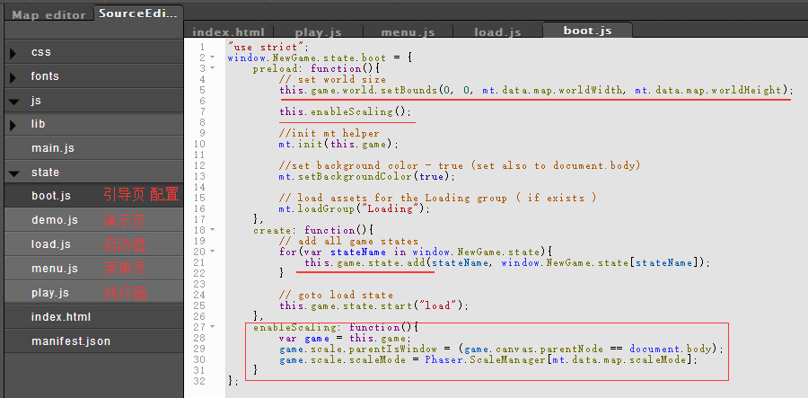

我一般只用到boot、demo、load三个场景
如果需要屏幕适配，在boot场景中编写代码
如果想要自己修改游戏启动效果(资源加载进度)可在load场景中编写代码
至于demo场景自然就是实现游戏的主程了

# Phaser MightyEditor Tutorials

## 场景切换

首先我们进入代码编辑器将场景文件中的代码全部删掉
然后在地图编辑器上面添加各个场景的游戏元素

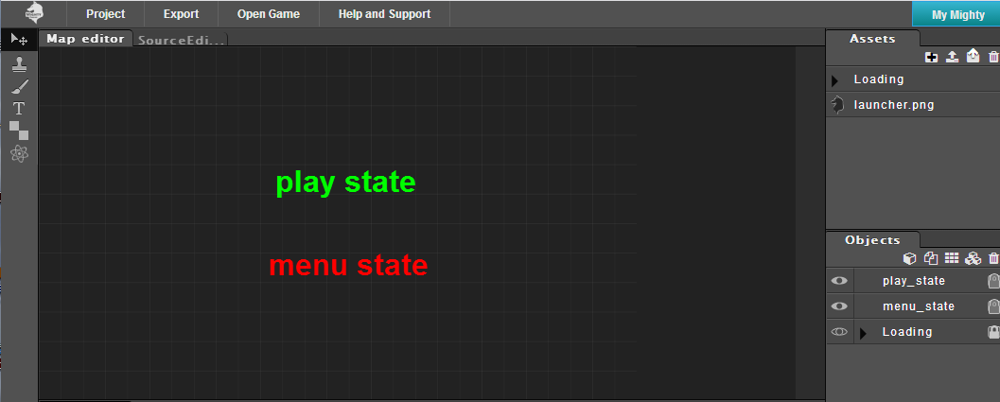

最后把代码中场景启动部分处理下

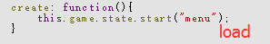

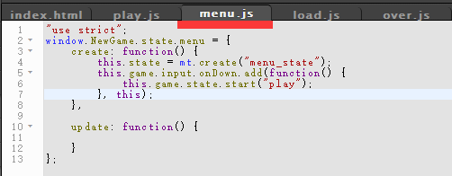

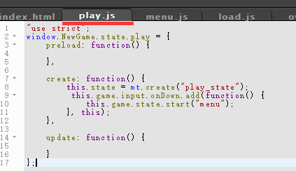

来看下执行效果

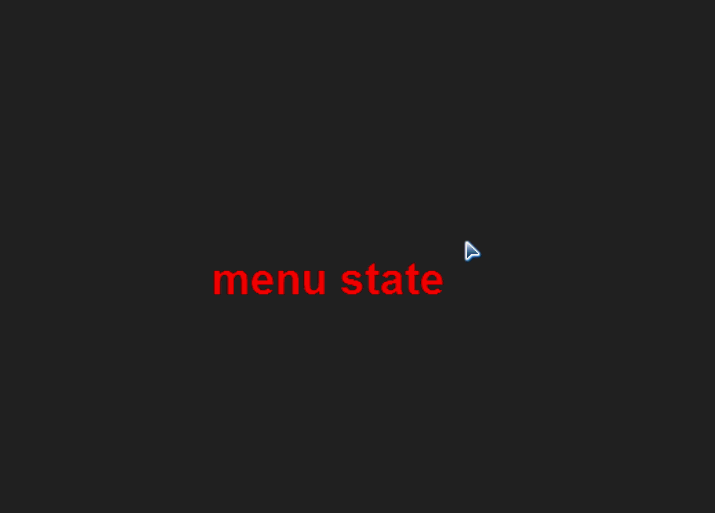

能够看到原本的游戏场景是menu，当鼠标单击后随即切换到了场景play，zai在场景单击亦是切换场景

## 附言

* 这里我们能够初步了解到PME的地图编辑器可以作为一个游戏资源存储的容器，需要某个游戏对象就将其创建出来，所以我们就可以利用这点快速创建出场景游戏和多个地图的游戏
* 如有场景menu、play，那么可以将场景分别设为组，在编辑场景地图时可以借助对象管理器中的对象左边的图标“眼睛”来使各个场景中的游戏对象显示或是隐藏，便于编辑当前场景。
* 以下为示意图

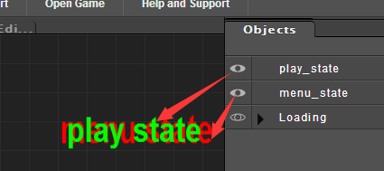

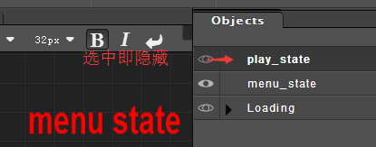

# Phaser MightyEditor Tutorials

## 屏幕适配

先把编辑器的屏幕适配贴上来

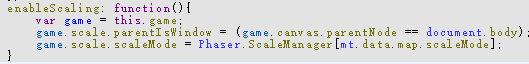

先设置游戏的父级容器，再设置游戏的比例缩放模式
mt.data.map.scaleMode即

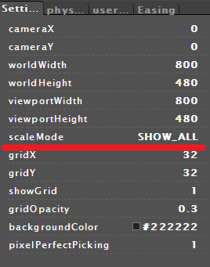

要想适配首先得知道游戏的执行环境是什么设备

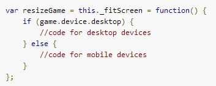

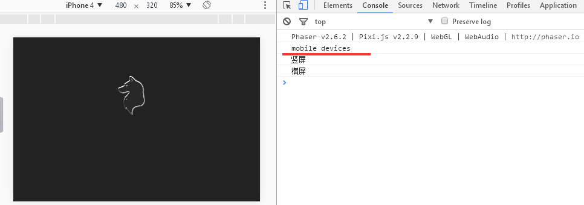

如果要横屏适配还需要知道当前屏幕的方向

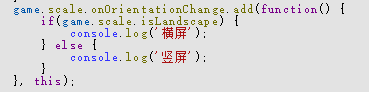

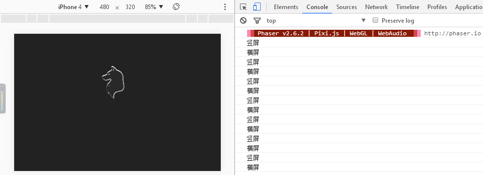

依据游戏屏幕的宽窄进行适配

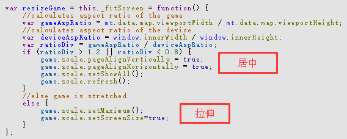

全屏适配

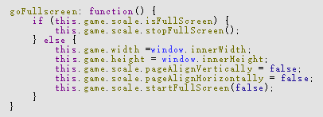

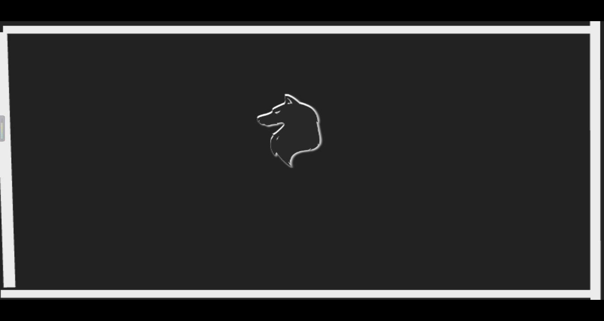

# Phaser MightyEditor Tutorials

## 游戏中的显示对象

###### 精灵
首先将游戏对象在地图编辑器上创建出来

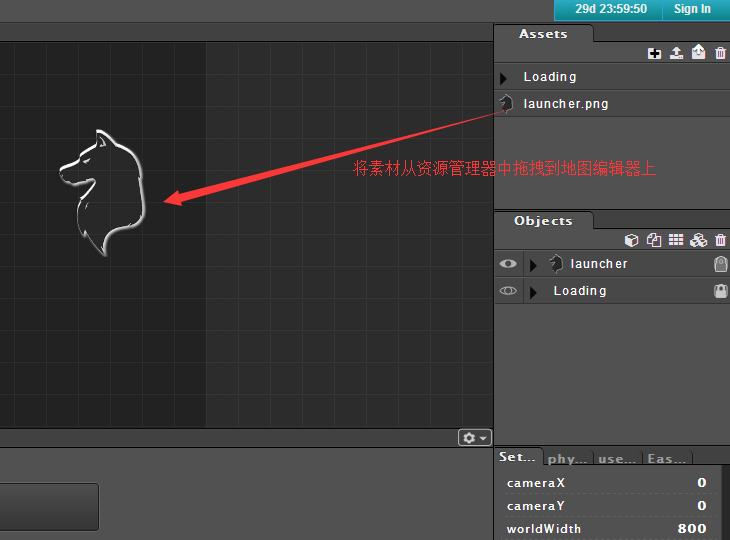

然后再在代码编辑器里面将游戏对象创建出来

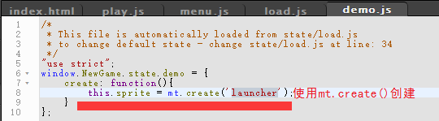

###### 精灵动画
导入精灵图将其拖拽到地图编辑器上

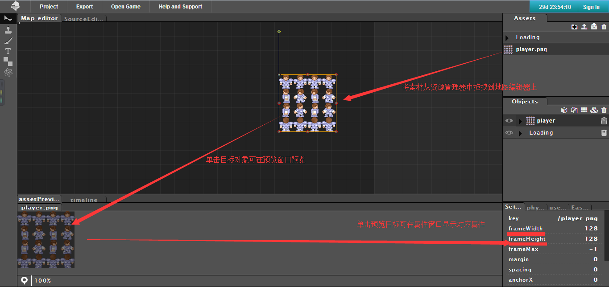

将框架大小修改成角色每一帧的大小

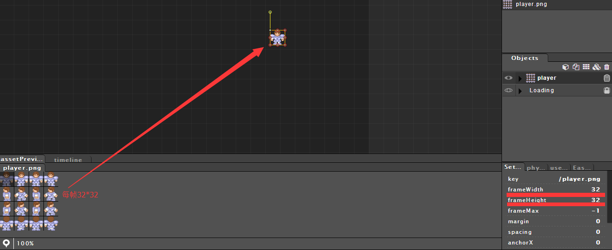

最后在代码编辑器中编写代码

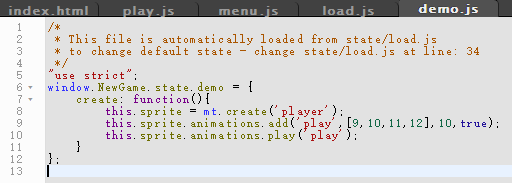

###### 从代码中创建

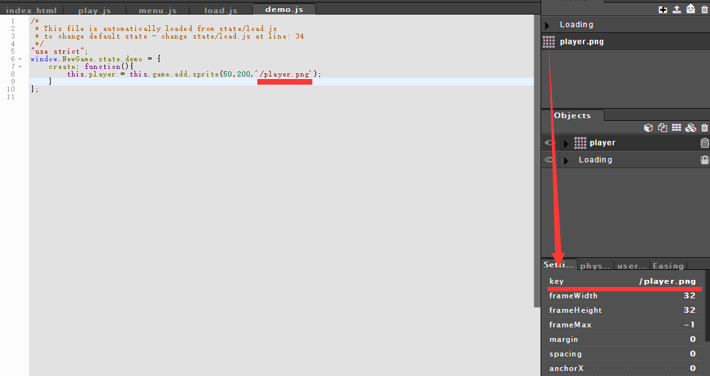

###### 贴图纹理集合
将贴图及和图片导入编辑器并创建

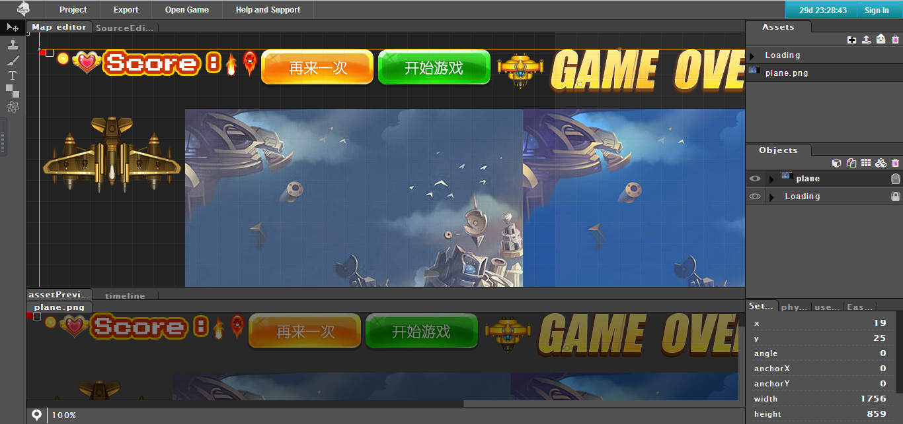

导入对应json

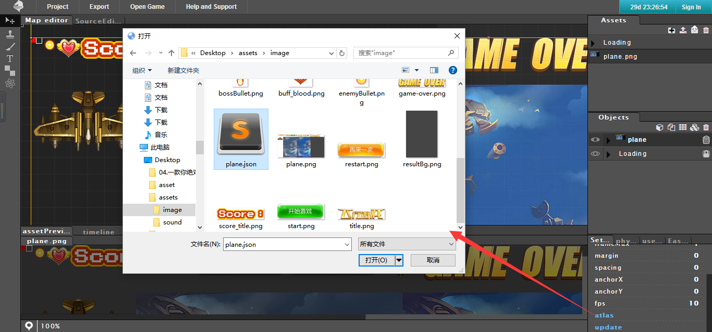

导入之后它便分好了帧

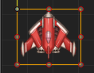

###### 组
对象管理器中的第一个图标即为添加组

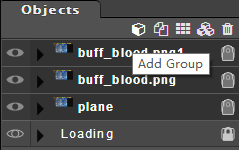

对象管理器中的第一个图标则为将选中对象加入组

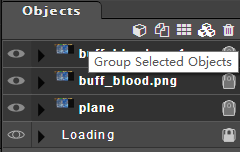

###### 文本对象
先在地图编辑器中创建文本对象

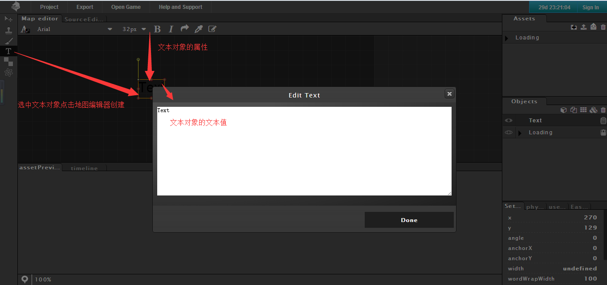

在代码中创建则使用mt.create()方法
具体可参照第一章第一个PME项目

##### 注 tilemap另行讲解
