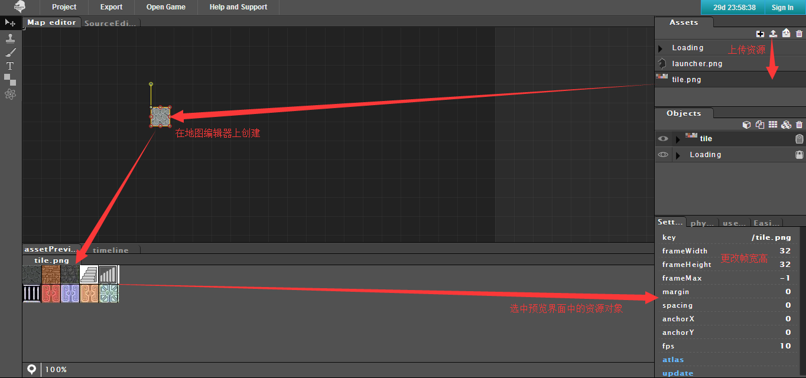
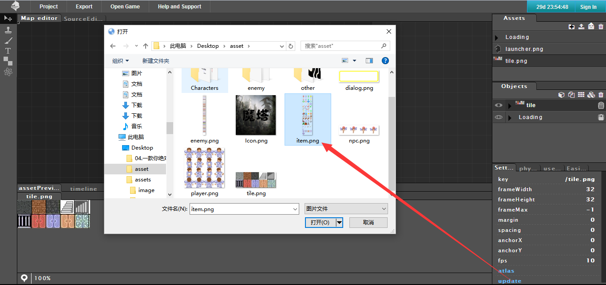
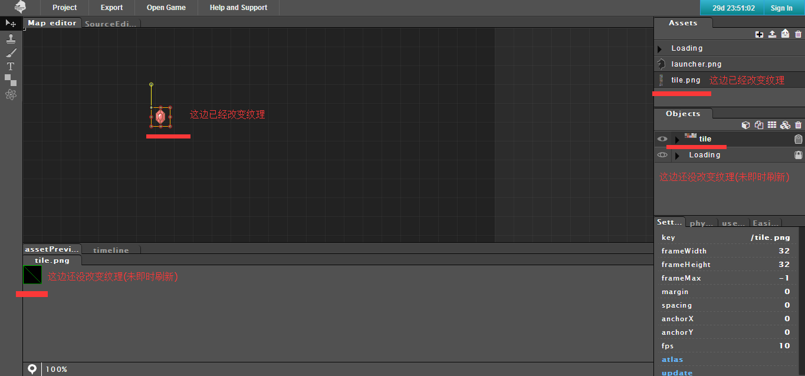
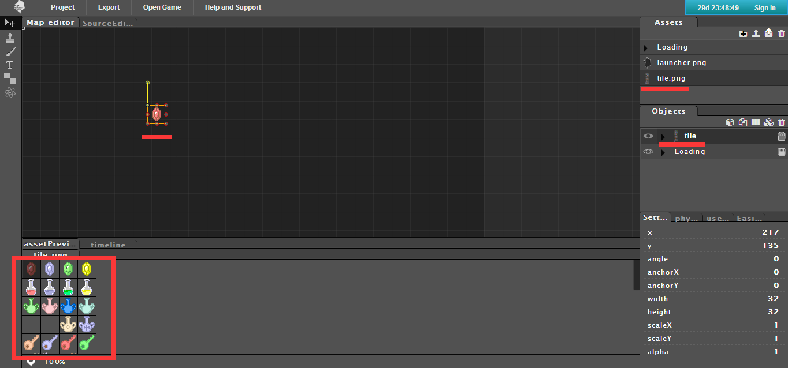
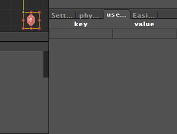
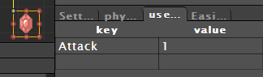
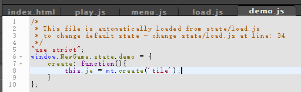
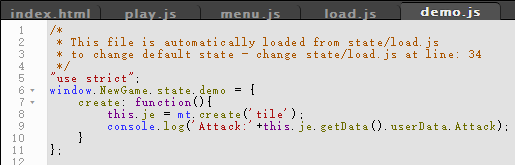
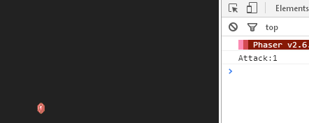

# Phaser MightyEditor Tutorials

感谢吕老师提供的[MightyEditor教程](PMEPRE.md)，MightyEditor是一个Phaser的IDE，吕老称其为黑马，大家觉得好的话可以扫描下方二维码给吕老师打赏。

## 杂项

#### 改变贴图纹理

首先上传素材，然后创建游戏对象，再修改帧的宽高

要改变资源的贴图纹理只需要点击属性窗口中的update然后选择新的精灵图即可

这边只需要刷新重新进入编辑器即可

#### 用户数据

选中游戏对象，点选属性窗口中的选项卡：userDate

在这里，我们给红宝石加上属性Attack其值为1

###### 获取对象的自定义属性的值

首先代码创建出游戏对象

然后用getData()方法获取对象的自定义属性值

看下执行效果

