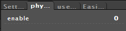
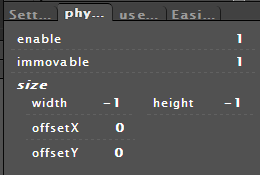
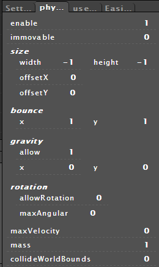
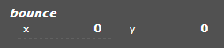
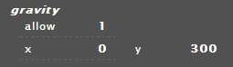
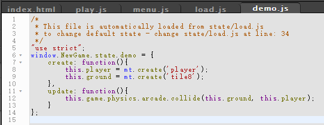
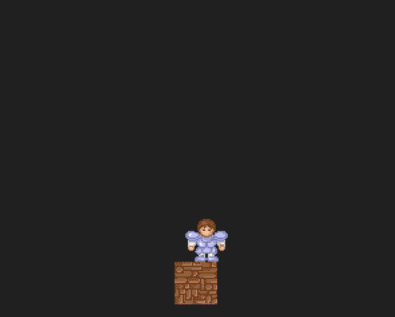
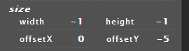
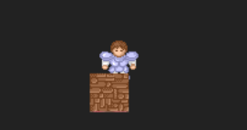

# Phaser MightyEditor Tutorials
## 基础物理
要是用物理引擎，只需要在目标对象上将其激活
未开启

开启后

enable          为激活状态          1
immovable       为不可移动状态      1
为了给游戏对象添加物理属性我们需要把该对象的移动状态属性值设置为零(可移动)

###### 常用物理属性
bounce              弹性系数
gravity             重力系数
collideWorldBounds  世界范围
size                对象
先将默认弹力去掉(将其值位置为零)

然后设置目标对象的重力

再把作为地板的游戏对象的物理开启即可

最后给两个游戏对象添加碰撞检测代码

看下执行效果

如果对象图片空白较大，可以用size下的offset使角色进行偏移

###### 注意
1. 在MightyEditor中物理引擎只有ARCADE
2. 在MightyEditor中使用物理引擎不需要手动开启
