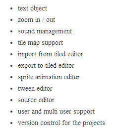
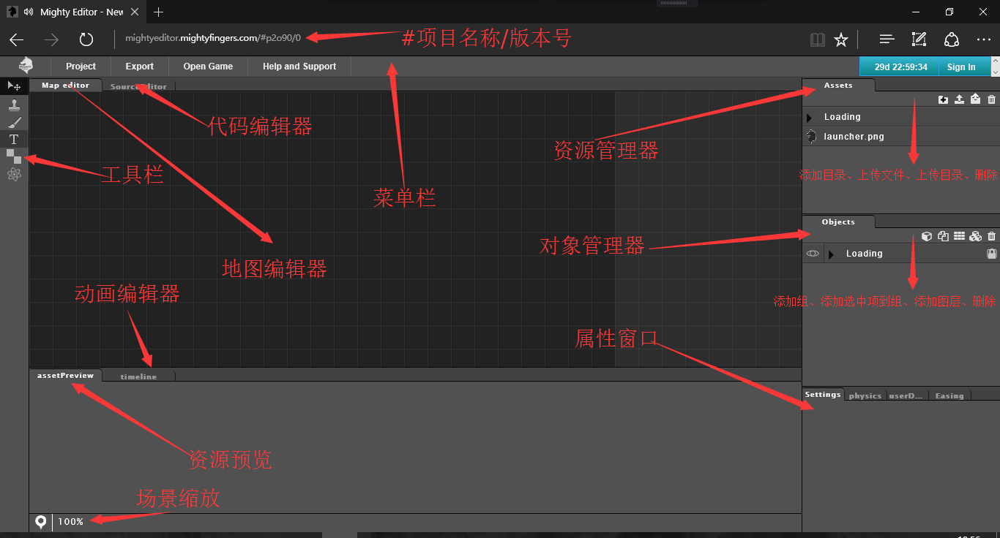
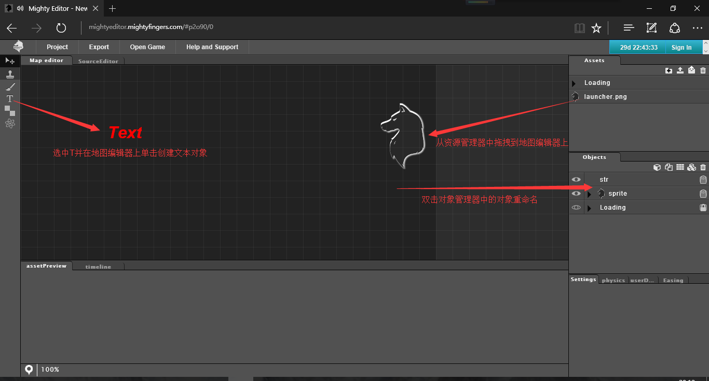
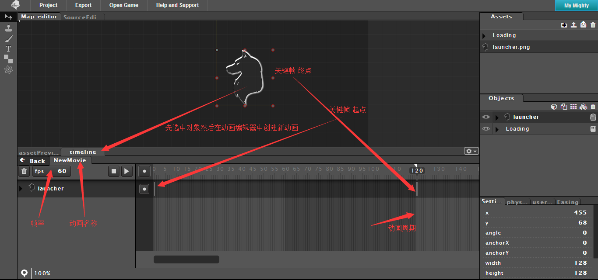
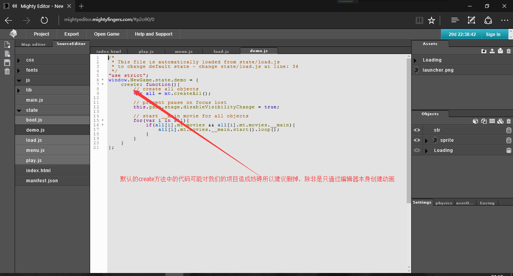
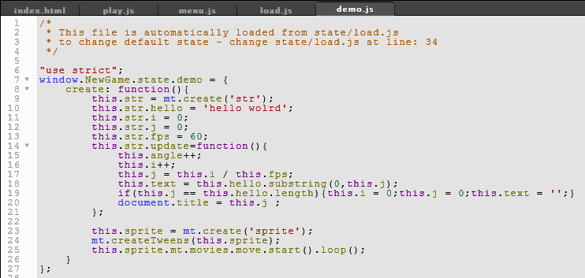

# Phaser MightyEditor Tutorials
## 开门见山

 

Click The Image To Start Your Game Delevelop

## 前言

有鉴于PME能够极大提高Phaser布局速度以及场景制作所以特此将笔者所学共享，虽是皮毛妄言，还望共勉！

## 介绍

MightyEditor是一个基于浏览器的可视化Phaser游戏编辑器。使用轻松、迅速定位对象并以秒为单位来创建地图。它还能导出到本地的Phaser代码，适合快速设置等级和场景。

#### 特性

## 环境搭建

在线版Phaser [MightyEditor](http://mightyeditor.mightyfingers.com).
离线版

###### 安装方法

首先，在[github](https://github.com/TheMightyFingers/mightyeditor)上下载编辑器源码。
二则，确保你的电脑上已经安装好nodejs。
三则，进入编辑器目录中的server目录，
按住shift键并鼠标右键，选择命令窗口，
输入npm install，安装后输入node Server.js，
最后在浏览器地址栏输入locahost:8080即可。
注意:如果安装失败则请到Phaser小站QQ群下载   Win7/Win10/Mac
## 第一个PME项目
作为第一个项目，就简单的写一个hello world吧。
首先介绍一下开发环境：

在地图编辑器上画出游戏对象：

在动画编辑器创建动画：

进入到代码编辑器界面：

简单实现代码：

看下执行效果：

