# Phaser MightyEditor Tutorials

## 瓦片地图

#### 改变贴图纹理

首先上传素材

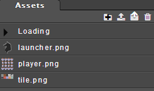

然后创建图层

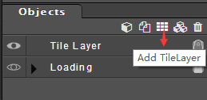

选中图层

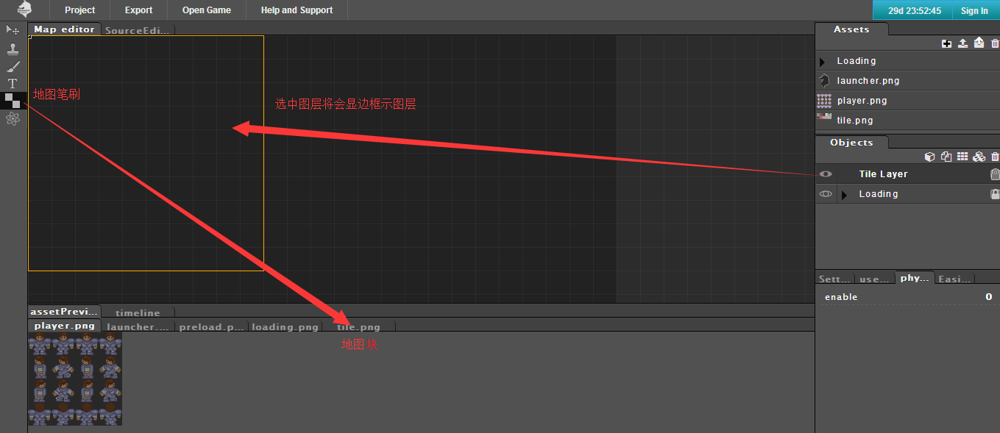

在预览中选中相应的地图块并在图层上将其创建

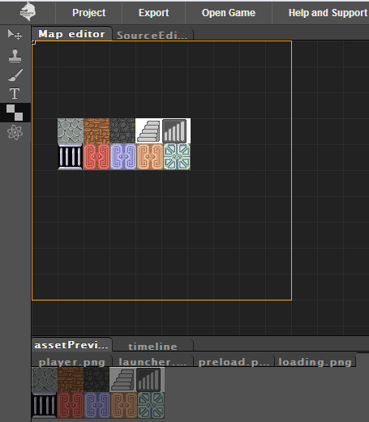

由于还没更改地图块宽高，所以给他改成相应大小，先选中资源，然后再在属性框中修改

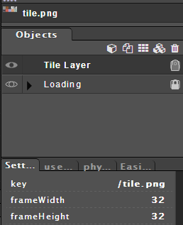

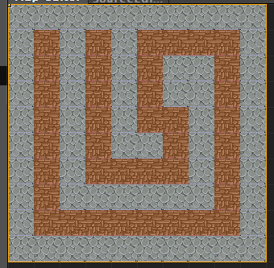

地图创建好之后，创建角色

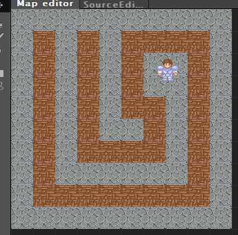

两者都创建好之后，给角色开启物理

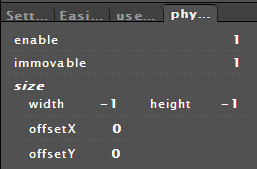

在代码编辑器中，先给角色添加移动事件

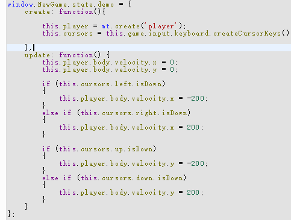

然后创建出地图

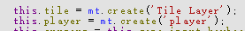

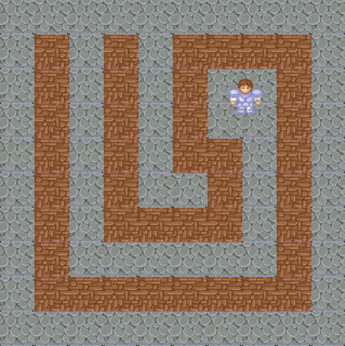

最后给两者添加碰撞代码

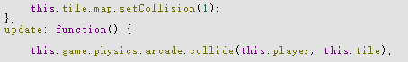

这样看起来不太清晰，我们打开debug

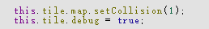

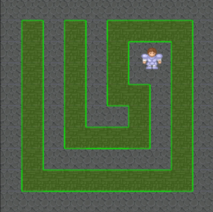

这样就能清晰的看出碰撞元素了
到这里瓦片地图的创建就结束了

setCollision(1)表示地图块精灵图中第1帧为碰撞元素

setCollisionBetween(0,3);表示0~3索引之间的元素都为碰撞元素

setCollisionByExclusion([0,1,4,5,6,7,8,11]);表示除了数组中的其余都为碰撞元素
